[Mamba-in-Low-level-vision](https://arxiv.org/search/advanced?advanced=&terms-0-operator=AND&terms-0-term=mamba&terms-0-field=all&terms-1-operator=OR&terms-1-term=%22state+space+model%22&terms-1-field=all&classification-computer_science=y&classification-physics_archives=all&classification-include_cross_list=include&date-year=&date-filter_by=date_range&date-from_date=2024&date-to_date=&date-date_type=submitted_date_first&abstracts=show&size=200&order=-announced_date_first&start=0)

<!--ts-->
   * [Image Restoration](#image-restoration)
   * [Image Denoising](#image-denoising)
   * [Image Deblur](#image-deblur)
   * [Image Dehazing](#image-dehazing)
   * [Image Deraining](#image-deraining)
   * [Video Demoireing](#video-demoireing)
   * [Low Light Enhancement](#low-light-enhancement)
   * [Image Super-Resolution](#image-super-resolution)
   * [Image Rectonstruction](#image-rectonstruction)
   * [Image Fusion](#image-fusion)
   * [Underwater Image Enhancement](#underwater-image-enhancement)

<!-- Created by https://github.com/ekalinin/github-markdown-toc -->
<!-- Added by: runner, at: Thu Aug 22 00:37:45 UTC 2024 -->

<!--te-->

## Image Restoration

2024-08-19 [Multi-Scale Representation Learning for Image Restoration with State-Space Model](https://arxiv.org/abs/2408.10145)

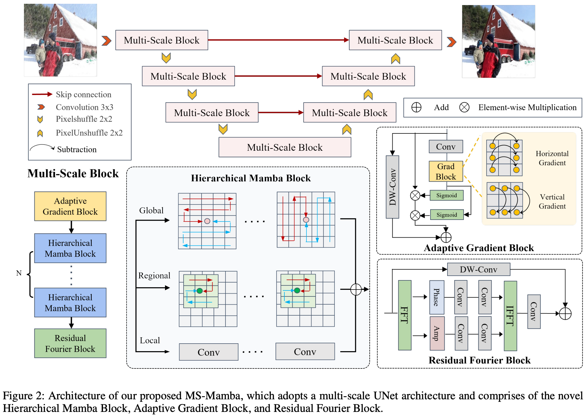

2024-04-17 [CU-Mamba: Selective State Space Models with Channel Learning for Image Restoration](https://arxiv.org/abs/2404.11778)

2024-03-26 [Serpent: Scalable and Efficient Image Restoration via Multi-scale Structured State Space Models](https://arxiv.org/abs/2403.17902)

2024-03-18 [VmambaIR: Visual State Space Model for Image Restoration](https://arxiv.org/abs/2403.11423) 

2024-02-23 [MambaIR: A Simple Baseline for Image Restoration with State-Space Model](https://arxiv.org/abs/2402.15648) ECCV 

## Image Denoising

2024-06-01 [Dual Hyperspectral Mamba for Efficient Spectral Compressive Imaging](https://arxiv.org/abs/2406.00449) 

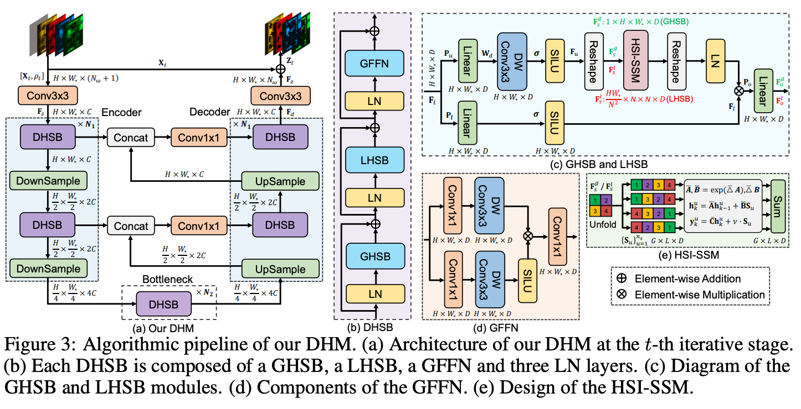

2024-05-02 [SSUMamba: Spatial-Spectral Selective State Space Model for Hyperspectral Image Denoising](https://arxiv.org/abs/2405.01726) 

2024-04-15 [HSIDMamba: Exploring Bidirectional State-Space Models for Hyperspectral Denoising](https://arxiv.org/abs/2404.09697)

## Image Deblur

2024-05-23 [Efficient Visual State Space Model for Image Deblurring](https://arxiv.org/abs/2405.14343)

2024-03-29 [Learning Enriched Features via Selective State Spaces Model for Efficient Image Deblurring](https://arxiv.org/abs/2403.20106)

## Image Dehazing

2024-05-16 [RSDehamba: Lightweight Vision Mamba for Remote Sensing Satellite Image Dehazing](https://arxiv.org/abs/2405.10030)

2024-02-16 [U-shaped Vision Mamba for Single Image Dehazing](https://arxiv.org/abs/2402.04139) 

## Image Deraining

2024-07-31 [RainMamba: Enhanced Locality Learning with State Space Models for Video Deraining](https://arxiv.org/abs/2407.21773v1) ACM-MM Oral 

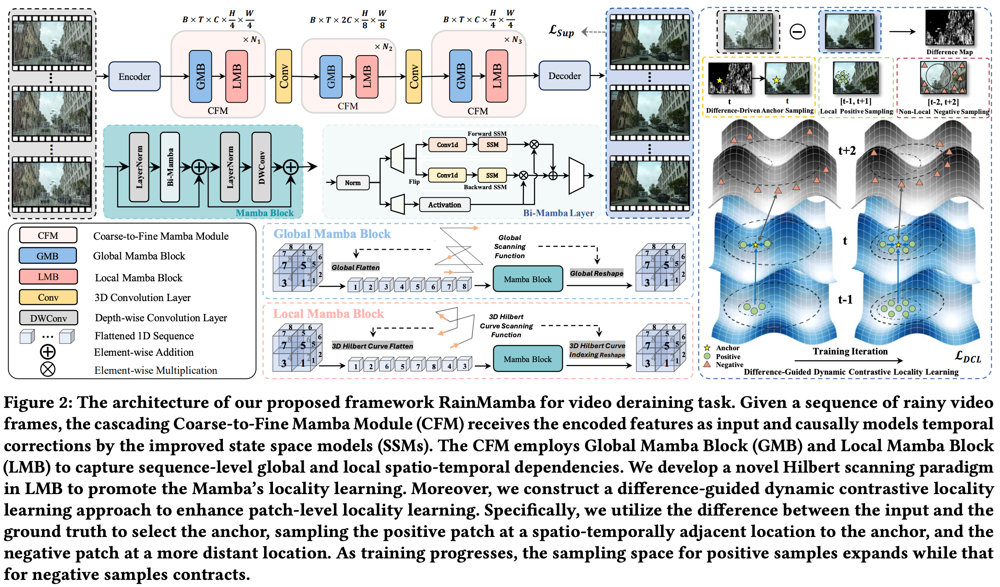

2024-05-29 [FourierMamba: Fourier Learning Integration with State Space Models for Image Deraining](https://arxiv.org/abs/2405.19450)

2024-05-26 [Image Deraining with Frequency-Enhanced State Space Model](https://arxiv.org/abs/2405.16470)

2024-04-15 [FreqMamba: Viewing Mamba from a Frequency Perspective for Image Deraining](https://arxiv.org/abs/2404.09476) ACM-MM 

## Video Demoireing

2024-08-20 [DemMamba: Alignment-free Raw Video Demoireing with Frequency-assisted Spatio-Temporal Mamba](https://arxiv.org/abs/2408.10679)

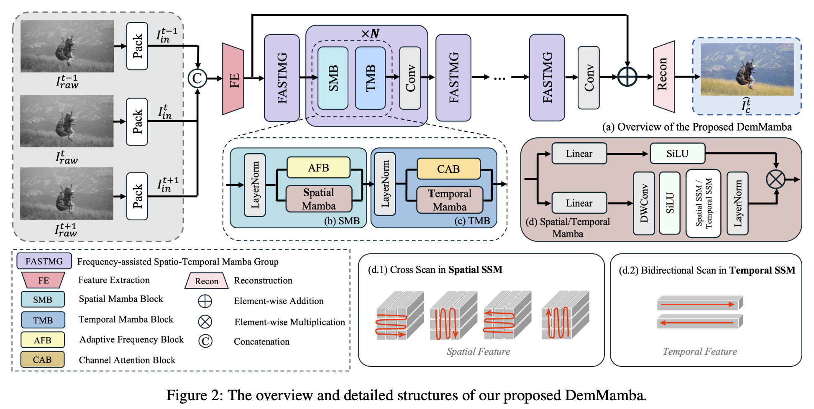

## Low Light Enhancement

2024-08-02 [Wave-Mamba: Wavelet State Space Model for Ultra-High-Definition Low-Light Image Enhancement](https://arxiv.org/abs/2408.01276)

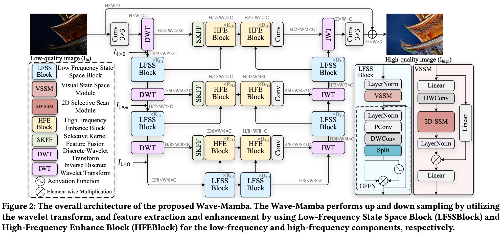

2024-07-03 [BVI-RLV: A Fully Registered Dataset and Benchmarks for Low-Light Video Enhancement](https://arxiv.org/abs/2407.03535)

2024-06-03 [LLEMamba: Low-Light Enhancement via Relighting-Guided Mamba with Deep Unfolding Network](https://arxiv.org/abs/2406.01028)

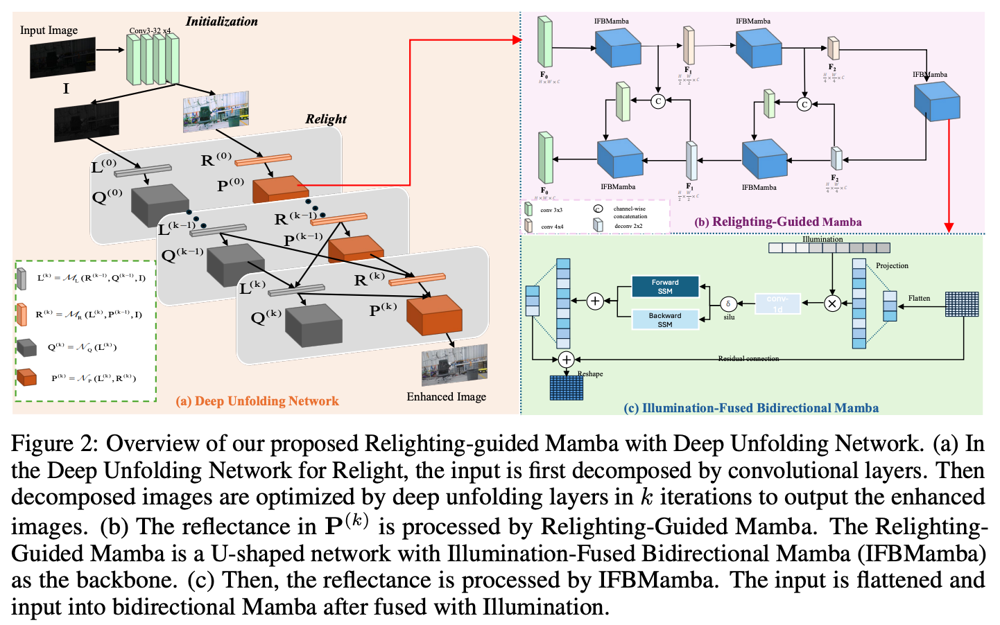

2024-05-25 [MambaLLIE: Implicit Retinex-Aware Low Light Enhancement with Global-then-Local State Space](https://arxiv.org/abs/2405.16105)

2024-05-06 [Retinexmamba: Retinex-based Mamba for Low-light Image Enhancement](https://arxiv.org/abs/2405.03349) 

## Image Super-Resolution

2024-08-16 [QMambaBSR: Burst Image Super-Resolution with Query State Space Model](https://arxiv.org/abs/2408.08665)

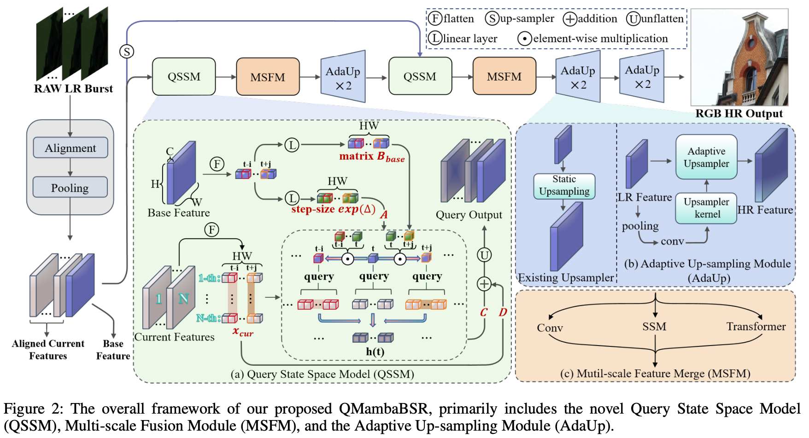

2024-07-08 [Self-Prior Guided Mamba-UNet Networks for Medical Image Super-Resolution](https://arxiv.org/abs/2407.05993)

2024-07-08 [Deform-Mamba Network for MRI Super-Resolution](https://arxiv.org/abs/2407.05969)

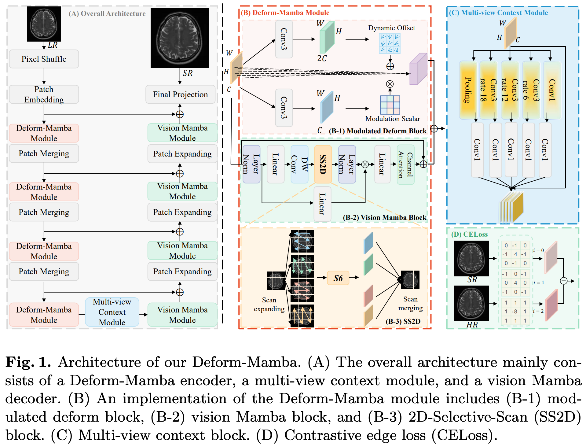

2024-06-23 [Mamba-based Light Field Super-Resolution with Efficient Subspace Scanning](https://arxiv.org/abs/2406.16083)

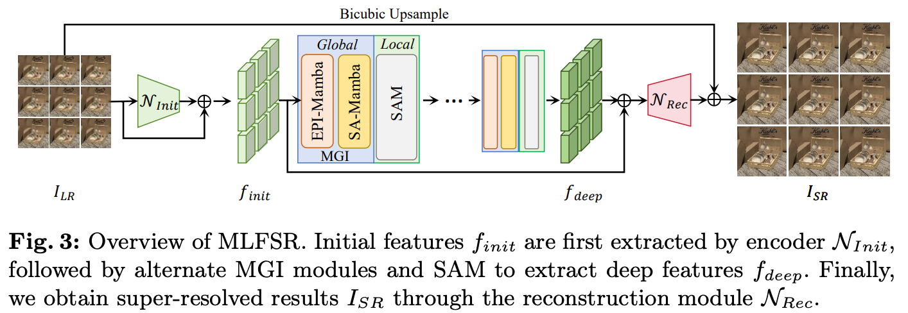

2024-06-18 [LFMamba: Light Field Image Super-Resolution with State Space Model](https://arxiv.org/abs/2406.12463)

2024-05-16 [IRSRMamba: Infrared Image Super-Resolution via Mamba-based Wavelet Transform Feature Modulation Model](https://arxiv.org/abs/2405.09873) 

2024-05-08 [Frequency-Assisted Mamba for Remote Sensing Image Super-Resolution](https://arxiv.org/abs/2405.04964)

2024-05-02 [DVMSR: Distillated Vision Mamba for Efficient Super-Resolution](https://arxiv.org/abs/2405.03008) 

2024-03-13 [Activating Wider Areas in Image Super-Resolution](https://arxiv.org/abs/2403.08330)

2024-02-19 [Pan-Mamba: Effective pan-sharpening with State Space Model](https://arxiv.org/abs/2402.12192) 

## Image Rectonstruction

2024-05-27 [Enhancing Global Sensitivity and Uncertainty Quantification in Medical Image Reconstruction with Monte Carlo Arbitrary-Masked Mamba](https://arxiv.org/abs/2405.17659)

2024-05-13 [GMSR:Gradient-Guided Mamba for Spectral Reconstruction from RGB Images](https://arxiv.org/abs/2405.07777)

2024-02-28 [MambaMIR: An Arbitrary-Masked Mamba for Joint Medical Image Reconstruction and Uncertainty Estimation](https://arxiv.org/abs/2402.18451)

## Image Fusion

2024-05-31 [S4Fusion: Saliency-aware Selective State Space Model for Infrared Visible Image Fusion](https://arxiv.org/abs/2405.20881)

2024-04-15 [FusionMamba: Dynamic Feature Enhancement for Multimodal Image Fusion with Mamba](https://arxiv.org/abs/2404.09498) 

2024-04-14 [A Novel State Space Model with Local Enhancement and State Sharing for Image Fusion](https://arxiv.org/abs/2404.09293)

2024-04-12 [MambaDFuse: A Mamba-based Dual-phase Model for Multi-modality Image Fusion](https://arxiv.org/abs/2404.08406)

2024-03-10 [FusionMamba: Efficient Image Fusion with State Space Model](https://arxiv.org/abs/2404.07932) 

## Underwater Image Enhancement

2024-06-12 [PixMamba: Leveraging State Space Models in a Dual-Level Architecture for Underwater Image Enhancement](https://arxiv.org/pdf/2406.08444) 

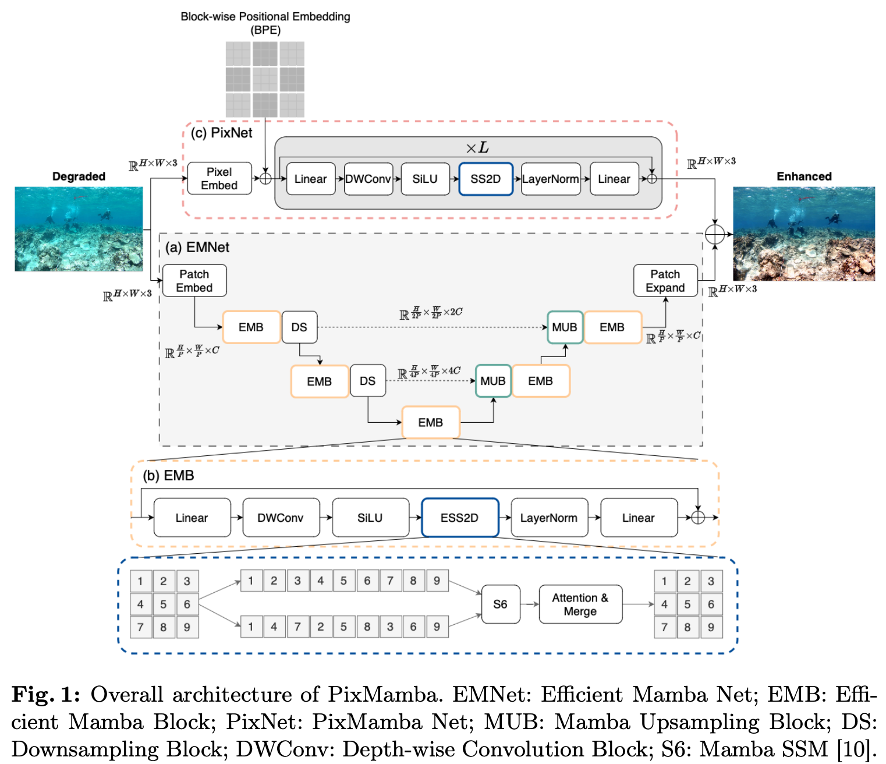

2024-05-14 [WaterMamba: Visual State Space Model for Underwater Image Enhancement](https://arxiv.org/abs/2405.08419)

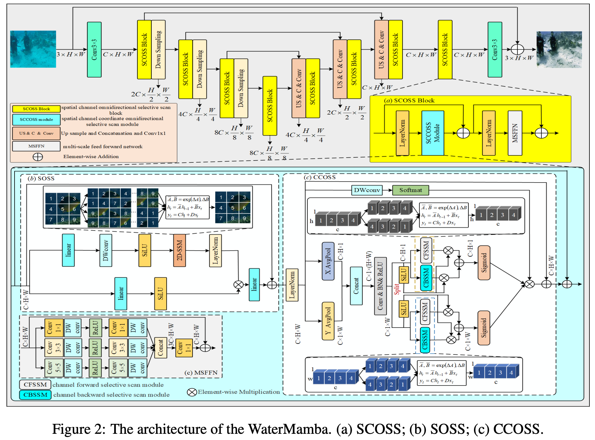

2024-04-22 [MambaUIE&SR: Unraveling the Ocean's Secrets with Only 2.8 FLOPs](https://arxiv.org/abs/2404.13884) 

